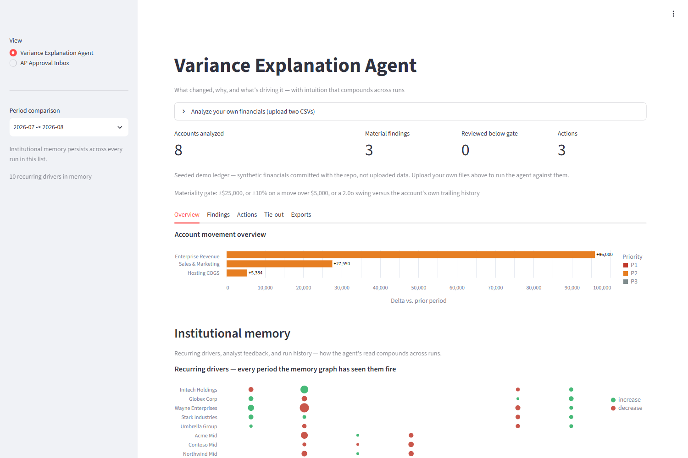
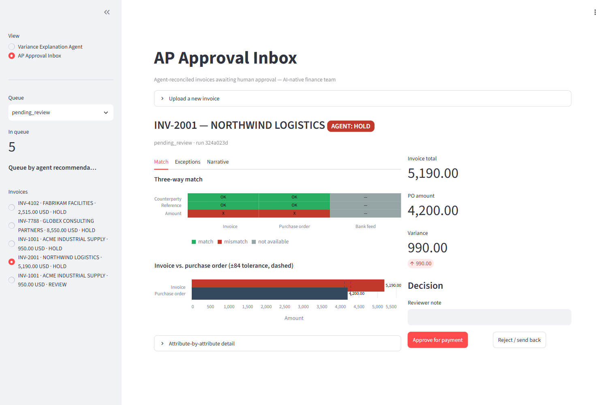

# DeltaFin — an agentic variance-explanation system

### ▶ [**Open the live demo**](https://sameerrajendra126--deltafin-ui-serve.modal.run) — no install, no login

Deployed on Modal. It scales to zero, so the first load after an idle period
takes ~20-30s to cold-start; after that it is instant. Two pages, both with
seeded data already in them:

- **Variance Explanation Agent** — pick any of the period comparisons in the
  sidebar. `2026-07 → 2026-08` is the one with the story in it. Or upload your
  own two CSVs in the panel at the top and it runs the real pipeline on them.
- **AP Approval Inbox** — five reconciled invoices awaiting a human decision.
  `INV-2001` shows a three-way match with a real control exception.

<sub>Public and unauthenticated by design, for demo purposes. Uploaded data is
processed in an isolated run and never enters the institutional memory built
from the seeded ledger.</sub>



<sub>The variance page. The gate is stated once; findings, actions, tie-out and
exports sit behind tabs; the timeline underneath is the memory graph showing
every period each driver has fired in — the evidence that the agent's read
compounds across runs.</sub>



<sub>The AP inbox. The match grid carries a redundant `OK`/`X`/`—` glyph so it
reads without colour; the tolerance band is drawn as dashed rules; the reviewer's
decision sits beside the evidence rather than behind a tab. Here the invoice is
$990 over its PO against an $84 tolerance, so the agent recommends `hold`.</sub>

---

**At a glance** — Python · LangGraph · self-hosted Qwen2.5-7B on vLLM (Modal,
A10G, scale-to-zero) · DuckDB · SQLite · Streamlit + Altair · 119 tests · CI ·
a scored eval harness against a labelled dataset. Two LangGraph pipelines, ten
and seven nodes. The LLM writes prose over already-computed numbers and never
changes one, and every model call has a deterministic fallback — so the system
runs end to end with no model configured at all.

---

Monthly account summaries and transaction-level CSVs go in; a prioritized,
owned variance brief comes out. The bar it is built to clear is the move from
*"Revenue increased 18%"* to *"Revenue increased 18%, driven by a 32% increase
in enterprise accounts, with three customers accounting for 64% of the
increase"* — and to get sharper the more months it has been run against, not
just once.

## What it actually produces

Real excerpt from [`examples/flux_2026-07_to_2026-08_9cc000e5.md`](examples/flux_2026-07_to_2026-08_9cc000e5.md),
unedited:

```markdown
## Recommended actions

| Priority | Account | Task | Owner |
|---|---|---|---|
| P2 · Review this close cycle | Enterprise Revenue | Ask Sales Ops to confirm whether the expansion at Globex Corp, Initech Holdings, and Stark Industries is a contracted run-rate or a one-time upsell before it's forecast forward. | Sales Ops |
| P2 · Review this close cycle | Sales & Marketing | Ask Marketing to provide a detailed breakdown of the TechConf Expo's performance, including attendee feedback and potential for future events. | Marketing |
| P2 · Review this close cycle | Hosting COGS | Ask Vendor Management to review the cost structure of CloudBeam Compute to identify any potential inefficiencies or negotiate better pricing terms. | Vendor Management |
| P2 · Review this close cycle | Insurance | Confirm the Insurance accrual: only 0.0% traced to subledger detail (gap $5,000.00). | Controller / Accounting |

### Enterprise Revenue (4000)

**Enterprise Revenue increased 32%, primarily driven by growth at 3 customers
accounting for 71% of the increase, with expansion at Globex Corp, Initech
Holdings, and Stark Industries.**

Delta: $+96,000.00 (+32.0%) · materiality: absolute-threshold · confidence: high

| Driver | Delta | Cohort | Share of account delta |
|---|---|---|---|
| Globex Corp | +30,000.00 | expansion | 31% |
| Initech Holdings | +20,000.00 | expansion | 21% |
| Stark Industries | +18,000.00 | expansion | 19% |
| Wayne Enterprises | +15,000.00 | expansion | 16% |
| Umbrella Group | +13,000.00 | expansion | 14% |
```

The Insurance row is the one worth pausing on: **it is never a variance at all.**
Nothing moved month over month, so no materiality gate fires on it. It surfaces
because ingestion also ties the subledger out against the summary, and an accrual
with 0% traced detail is worth confirming whether or not the number changed.
`compile_action_plan` folds tie-out gaps into the same prioritized list as
findings — and ranks them by the money behind the gap, so a $5,000 accrual sits
below a $96,000 revenue swing instead of above it.

`examples/` also holds the matching `.xlsx` workpaper (`Summary` / `Actions` /
`Findings` / `Drivers` / `Tie-Out` sheets) and a trimmed excerpt of the
cross-run memory graph.

## What this demonstrates

- **A hard deterministic/LLM boundary, drawn where finance needs it.**
  `app/flux/variance.py` computes every delta, percentage, z-score against a
  6-month trailing baseline, and materiality decision; `app/flux/slicer.py`
  computes every driver, cohort label, and concentration share;
  `app/flux/actions.py` assigns every priority and owner. The model is handed
  those already-computed facts and asked only to write prose over them. Nothing
  it emits changes a number — and `explain_drivers` / `synthesize_brief` both
  fall back to a driver-table-derived template when no endpoint is configured
  or a response fails to parse, so the pipeline has no hard dependency on the
  model at all.
- **Cross-run memory shaped like the task, not like a chat log.**
  `app/flux/memory.py` keeps `account_code::driver_key` edges (`5000::CloudBeam
  Compute`) in a JSON graph, so "has this exact vendor driven this exact account
  before, and for how many consecutive periods" is an O(1) lookup on an exact
  key — not a similarity search over past narratives. That is what lets a
  headline say *recurring* instead of re-deriving the streak from history every
  run. An append-only SQLite table alongside it is the system of record for what
  was said and when.
- **A closed analyst-feedback loop.** The Streamlit flux page
  (`ui/streamlit_app.py`) resolves the displayed findings to their real SQLite
  ids via `memory.findings_for_run`, renders a Confirm / Off-base control per
  finding, and calls `memory.record_feedback` — which writes a `feedback` row
  and stamps `last_verdict` / `last_note` onto that account's graph edges.
  `memory.recall()` reads those two fields, so the next run's `explain_drivers`
  prompt carries the analyst's prior verdict. (`ARCHITECTURE.md` documents
  where this loop is currently too coarse.)
- **Self-hosted serving, not a hosted API key.** `modal_app/qwen_reasoner.py`
  runs Qwen2.5-7B-Instruct under vLLM behind an OpenAI-compatible endpoint on
  Modal, on an A10G, with no `min_containers` — it scales to zero between runs
  and pays a cold start on the first call after `scaledown_window=180`. Weights
  live in a Modal Volume so a cold start re-downloads nothing. `app/llm.py`
  speaks to it as the only provider.
- **Columnar ingestion under an explicit memory ceiling.** `app/flux/ingest.py`
  uses DuckDB to `read_csv_auto` two file globs — 20 periods of summaries and
  subledgers — straight into typed in-memory tables, with a `_MEMORY_LADDER`
  probe because DuckDB's auto-detected limit OOMs on the multi-file glob. All
  the driver decomposition is then SQL against those tables. The AP pipeline's
  semantic layer (`app/store.py`) is a separate SQLite database standing in for
  ERP / bank feed / vendor master.
- **An interface built for the person who has to sign off.** Both pages are
  chart-first (`ui/charts.py`, Altair): a waterfall bridging prior to current
  balance, driver contribution by cohort, a concentration strip, subledger
  coverage inverted so the *unreconciled* account is the longest bar rather
  than the missing one, and a three-way-match grid carrying a redundant
  `OK`/`X`/`—` glyph so it survives colourblindness and greyscale printing. The
  AP reviewer's approve/reject panel is pinned beside the evidence, never
  behind a tab. One fixed colour scale per field means a colour means the same
  thing on every chart in the app.

## Technology and tools implemented

Everything below is in the repo and exercised by the demo above. The second
table is deliberately included: what a system *doesn't* do, and why, says as
much as what it does.

### Agent architecture and orchestration

| | Where | What it does |
|---|---|---|
| **LangGraph** state machines | `app/flux/graph.py`, `app/graph.py` | Two pipelines — 10 nodes (variance) and 7 (AP reconciliation) — as explicit typed-state graphs. Linear, no conditional edges: an audit trail is worth more here than dynamic routing. |
| **Tool-free, computation-first agent design** | `app/flux/variance.py`, `slicer.py`, `actions.py` | The deterministic core computes every delta, z-score, materiality decision, cohort label, concentration share, priority and owner. The model is handed finished facts. |
| **Human-in-the-loop approval** | `ui/streamlit_app.py`, `app/store.py` | The AP agent emits a *recommendation* (`hold`/`review`/`approve`), never a payment. A reviewer decides, and the decision is written to an `approvals` audit trail. |
| **Closed feedback loop** | `app/flux/memory.py` | Confirm / Off-base on a finding writes a verdict onto the memory graph, which is read back into the next run's prompt. |

### LLM serving and integration

| | Where | What it does |
|---|---|---|
| **Self-hosted inference, not a vendor API key** | `modal_app/qwen_reasoner.py` | Qwen2.5-7B-Instruct under **vLLM 0.6.3** behind an OpenAI-compatible endpoint, on a Modal **A10G**. No `min_containers` — scales to zero, weights cached in a Modal Volume so a cold start re-downloads nothing. |
| **Provider-agnostic client** | `app/llm.py` | `langchain-openai` `ChatOpenAI` pointed at that endpoint. Bounded timeout, `max_retries=0` — a cold start fails fast into the deterministic path instead of hanging the UI. |
| **Graceful degradation as an invariant** | every LLM caller | With no endpoint configured, `explain_drivers` and `synthesize_brief` take template paths and the pipeline still produces a complete brief. The eval harness runs in exactly this mode. |
| **Structured output with a parse fallback** | `app/flux/graph.py`, `app/extraction.py` | JSON is extracted and parsed from the response; a malformed reply falls through to deterministic logic rather than raising. |
| **Prompt design constrained to narration** | `app/flux/graph.py` | The model is given computed drivers, shares and recalled history and asked to write prose over them. Nothing it emits changes a number. |
| **Serverless GPU deployment** | `modal_app/` | Both the model endpoint and the Streamlit UI deploy to Modal; secrets are injected as a named Modal secret, never baked into the image. |

### Data, memory, and retrieval

| | Where | What it does |
|---|---|---|
| **Columnar analytical ingestion** | `app/flux/ingest.py` | DuckDB `read_csv_auto` over two file globs into typed in-memory tables; all driver decomposition is SQL. Includes a memory-ladder probe because DuckDB's auto-detected limit OOMs on the multi-file glob. |
| **Cross-run memory as a knowledge graph** | `app/flux/memory.py` | `account_code::driver_key` edges in a JSON graph, plus an append-only SQLite history. "Has this vendor driven this account before, and for how many periods" is an **O(1) exact-key lookup**. |
| **Semantic layer over a financial system of record** | `app/store.py` | SQLite standing in for ERP / bank feed / vendor master, queried for the three-way match. |
| **Statistical anomaly detection** | `app/flux/variance.py` | Z-score against a 6-month trailing baseline, combined with absolute and percentage materiality gates and an explicit precedence order. |
| **Data isolation guarantee** | `app/flux/uploads.py` | An uploaded company's figures run through the same graph with memory reads and writes disabled, so demo data never contaminates institutional history. |

### Evaluation and engineering practice

| | Where | What it does |
|---|---|---|
| **Scored eval harness against a labelled set** | `evals/` | The synthetic generator plants known stories; the harness replays all 19 comparisons and asserts detection, materiality reason, planted amounts, driver attribution and cohort labels. Results below. |
| **Deterministic, reproducible evaluation** | `evals/run_evals.py` | Forces `get_llm()` to `None` so a scored run measures the pipeline, not model sampling. Non-zero exit on assertion failure. |
| **Test suite and CI** | `tests/`, `.github/workflows/` | 119 tests. CI additionally runs `ruff --select F821,F811` across the app because a UI refactor once shipped a `NameError` visible only at render time. |
| **Accessible, theme-aware visualization** | `ui/charts.py` | Altair throughout, one fixed colour scale per field, colourblind-safe (Okabe-Ito-derived), with redundant non-colour encodings where a status is being read. Pure functions: DataFrames in, charts out. |

## Architecture

```
  data/financials/            ┌──────────────────────────────────────────────┐
    summaries/*.csv           │      LangGraph  (app/flux/graph.py)          │
    transactions/*.csv  ─────►│                                              │
                              │  ingest_periods ──────► DuckDB (ingest.py)   │
                              │        ↓                 + subledger tie-out │
                              │  compute_variances ────► variance.py         │
                              │        ↓                 delta / % / z-score │
                              │  rank_materiality ─────► materiality gate    │
                              │        ↓                                     │
                              │  slice_drivers ────────► slicer.py           │
                              │        ↓                 cohorts + concentr. │
                              │  recall_memory  ◄──────────────────┐         │
                              │        ↓                           │         │
                              │  explain_drivers ─────► LLM        │         │
                              │        ↓                           │         │
                              │  compile_action_plan ─► actions.py │         │
                              │        ↓                           │         │
                              │  synthesize_brief ────► LLM        │         │
                              │        ↓                           │         │
                              │  persist_memory ───────────────────┤         │
                              │        ↓                           │         │
                              │  render_artifacts ────► brief.py   │         │
                              └─────────────────┬──────────────────┼─────────┘
                                                │                  │
                                                ▼                  ▼
                                     out/flux/*.md, *.xlsx   institutional memory
                                                             data/flux_memory_graph.json
                                                             data/flux_memory.db
                                                                   ▲
                                                                   │ Confirm / Off-base
                                                       Streamlit flux page (analyst)
```

Ten nodes, linear, no conditional edges. The memory store is read by
`recall_memory` and written by `persist_memory`, so what one run learns is
available to the next. The LLM touches exactly two nodes — `explain_drivers`
and `synthesize_brief` — both of which write prose only, and both of which have
a deterministic fallback.

## Quickstart

```bash
pip install -r requirements.txt
cp .env.example .env          # MODAL_QWEN_URL optional; unset runs deterministic

python data/seed_flux.py      # 20 months of synthetic summaries + subledgers
python run_flux.py --replay   # every period oldest-first, so memory accumulates
streamlit run ui/streamlit_app.py
```

**Or bring your own numbers.** The flux page has an "Analyze your own financials"
panel: drop in a period summary and a transaction subledger and it runs the same
graph over them, returning the analysis, the prioritized action plan, and
downloadable artifacts. Those runs are **isolated** — an uploaded company's data is
never read into, or written into, the institutional memory built from the seeded
ledger (`app/flux/uploads.py`).

Add as many files as you like, in any order — each is sorted into "summary" or
"transaction detail" by its columns, files of the same kind are concatenated, and
the **latest two `YYYY-MM` periods** across the result are compared. So one file
per period works (drop `2026-07.csv` and `2026-08.csv` from both
`data/financials/summaries/` and `data/financials/transactions/`), and so does a
single file already spanning several months. The only hard requirement is two
distinct periods in total, and at least one file of each kind.

Pick your periods deliberately if you're demoing: 5 of the 19 comparisons in the
seeded dataset have **nothing** above the materiality gate — including the first
three (`2025-01`→`02`, `02`→`03`, `03`→`04`), which are the files you'd grab
first. That is a real result, not a failure, and the page says so and still shows
the tie-out gaps, the action plan and the largest sub-threshold movements. But
`2026-07`→`2026-08` is the one with the story: a 32% enterprise-revenue jump
concentrated in three customers, the recurring hosting overrun, and the
August-only conference sponsorship.
[`examples/upload_sample_summary.csv`](examples/upload_sample_summary.csv) and
[`examples/upload_sample_transactions.csv`](examples/upload_sample_transactions.csv)
are a ready-made pair (2026-07 + 2026-08); the panel offers them for download
directly.

`python run_flux.py 2026-08` runs a single comparison instead. The seeded
dataset has planted stories to find (`data/seed_flux.py` names them in its
docstring): a 32% enterprise-revenue jump concentrated in three customers, a
hosting overrun recurring three months running, an August-only conference
sponsorship, a churned mid-market customer, a one-off legal fee, and the
subledger-less Insurance accrual.


```bash
python data/seed.py
python run_demo.py
```

Built for the AI x Finance "Money Talks" hackathon, Money Operations track.
